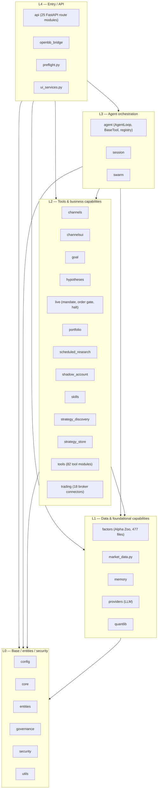

# Architecture

> Layered architecture of the Vibe-Trading backend (`agent/src`, 31 packages/modules): dependency rules, end-to-end critical paths, key abstractions, error patterns, and the frozen circular-dependency debt register.

## Layered Package Graph

Nodes are the 31 top-level packages/modules under `agent/src`; `market_data.py`, `preflight.py`, and `ui_services.py` are single-file modules, not packages. Subgraphs show the intended layers (L0 → L4). Edges between subgraphs show the **allowed** import direction; the real import graph has 104 edges plus the frozen exceptions documented below.

## Package Table

File counts and responsibilities are from the AST-based package analysis of `agent/src` (942 Python files in the backend tree).

| Package | Layer | Files | Responsibility |
| --- | --- | --- | --- |
| `config` | L0 | 9 | Configuration and runtime paths: `AgentConfig` schema, `.env` accessor, migration, limits (`agent/src/config/schema.py`, `agent/src/config/accessor.py`). |
| `core` | L0 | 3 | Shared kernel primitives: state and runner (`agent/src/core/state.py`, `agent/src/core/runner.py`). |
| `entities` | L0 | 4 | Financial domain entities: Entity/Instrument/Security/Fund/Bond (`agent/src/entities/models.py:142-330`). |
| `governance` | L0 | 3 | Run manifest plus tamper-evident hash-chain ledger (`agent/src/governance/ledger.py:208`); no internal dependencies. |
| `security` | L0 | 5 | Output redaction, workspace policy, network access control (`agent/src/security/network.py`, `agent/src/security/workspace_policy.py`). |
| `utils` | L0 | 1 | Generic utility functions. |
| `factors` | L1 | 477 | Alpha Zoo: 5 factor families / ~460 alphas; largest package (`agent/src/factors`). |
| `market_data` | L1 | 1 | Unified market-data entry: code→source detection `detect_source` and cross-source `fetch_market_data` (`agent/src/market_data.py:67`, `agent/src/market_data.py:179`). |
| `memory` | L1 | 7 | Cross-session `PersistentMemory` (`agent/src/memory/persistent.py`; carries one up-edge to `agent`, see debt register). |
| `providers` | L1 | 8 | LLM provider abstraction and streaming chat: ChatLLM/LLMResponse/ProviderStreamError (`agent/src/providers/chat.py:112-324`). |
| `quantlib` | L1 | 25 | Tested in-house financial math primitives (first-party `src/quantlib`, not the PyPI QuantLib). |
| `channels` | L2 | 34 | IM channel adapters and runtime: Telegram/Discord/Slack/Feishu/WhatsApp and more (`agent/src/channels/manager.py`, `agent/src/channels/runtime.py`). |
| `channelsui` | L2 | 8 | WebUI compatibility helpers for channel adapters (`agent/src/channelsui/http_utils.py`). |
| `goal` | L2 | 5 | Research-goal runtime: GoalStore and goal models (`agent/src/goal/store.py`, `agent/src/goal/models.py:36`). |
| `hypotheses` | L2 | 3 | Persistent research-hypothesis registry (`agent/src/hypotheses`). |
| `live` | L2 | 27 | Live-trading safety layer: mandate, order gate, kill switch (halt), broker-tool classification/wrapping (`agent/src/live/order_guard.py:101`, `agent/src/live/registry.py:184`). |
| `portfolio` | L2 | 11 | Read-only multi-broker portfolio aggregation, PortfolioService (`agent/src/portfolio/service.py`). |
| `scheduled_research` | L2 | 8 | Scheduled research-report job model, store, executor (`agent/src/scheduled_research/service.py`, `agent/src/scheduled_research/executor.py`). |
| `shadow_account` | L2 | 9 | Shadow account: reproducible profitable-pattern extraction from fill logs (`agent/src/shadow_account/extractor.py:31`). |
| `skills` | L2 | 29 | Research skill-pack content and loading support (`agent/skills` + `agent/src/agent/skills.py:100`). |
| `strategy_discovery` | L2 | 8 | Strategy discovery: evidence-gated Alpha Zoo + SDM facade (`agent/src/strategy_discovery/facade.py:185`). |
| `strategy_store` | L2 | 8 | Strategy persistence and adaptation (`agent/src/strategy_store/adaptation.py:17`). |
| `tools` | L2 | 82 | Tool implementations (market data, backtest, portfolio, goals, swarm, live...), auto-registered as BaseTool subclasses (`agent/src/tools/__init__.py:34`, `agent/src/tools/__init__.py:76`). |
| `trading` | L2 | 97 | Trading facade and 18 broker connectors: functional check_connection/place_order services plus `connectors/*` SDK/MCP adapters (`agent/src/trading/service.py:188`, `agent/src/trading/service.py:685`). |
| `agent` | L3 | 18 | Agent core: AgentLoop ReAct loop, BaseTool/ToolRegistry, ContextBuilder, SkillsLoader (`agent/src/agent/loop.py:1071`, `agent/src/agent/tools.py:13`, `agent/src/agent/tools.py:68`). |
| `session` | L3 | 9 | Sessions: SessionService, persistence attempts, SSE event bus, one AgentLoop per session (`agent/src/session/service.py:46`, `agent/src/session/service.py:483`). |
| `swarm` | L3 | 9 | Multi-agent orchestration: SwarmRuntime/worker hand-written ReAct loop, grounding, presets (`agent/src/swarm/runtime.py:251`, `agent/src/swarm/worker.py:449`). |
| `api` | L4 | 25 | FastAPI route layer (runs/sessions/live/swarm/alpha/channels/scheduled...), assembled by `agent/api_server.py`. |
| `openbb_bridge` | L4 | 6 | OpenBB Workspace adapter exposing AgentLoop as a custom agent (`agent/src/openbb_bridge`). |
| `preflight` | L4 | 1 | Pre-start data-source/LLM connectivity checks; failures only warn (`agent/src/preflight.py:1`). |
| `ui_services` | L4 | 1 | Frontend workbench data-shaping service shared by api_server and CLI (`agent/src/ui_services.py:1`). |

## Dependency Rules

The layering contract is mechanical, not advisory:

1. **Forward edges (higher layer → lower layer)** are freely allowed, e.g. `api` → `tools`, `agent` → `config`.
2. **Reverse edges (lower layer → higher layer) are forbidden by default.** Eight pre-existing reverse edges are frozen in `grandfathered_reverse_edges` in `harness/config/layer-map.json` and enforced by the stdlib-AST gate `scripts/lint-deps` (entry roots `agent/cli`, `agent/api_server.py`, `agent/mcp_server.py`, `agent/backtest` are intentionally outside the scan):
   - `tools` → `agent` (L2 → L3; the P0 base-class inversion)
   - `tools` → `swarm` (L2 → L3)
   - `tools` → `session` (L2 → L3; P3; pairs with the `session` → `tools` forward edge)
   - `channels` → `session` (L2 → L3)
   - `factors` → `tools` (L1 → L2)
   - `security` → `channels` (L0 → L2)
   - `scheduled_research` → `api` (L2 → L4)
   - `memory` → `agent` (L1 → L3)
   Any new reverse edge fails the lint; remove the dependency or propose a layer-map change with reviewer sign-off.
3. **Every top-level `agent/src` node must be registered in the layer map** (all 31 nodes; single-file modules listed under `module_nodes`). Unregistered nodes/import targets are ERRORs — no blind spots.
4. **Same-layer bidirectional dependencies are reported as WARNING**, not errors. The 17 known pairs are listed in the debt register below; unregistered new pairs also WARN and ask to be registered.
5. At package granularity Tarjan finds one large 18-node SCC — a symptom of the coarse aggregation; the pair-level register is the operative view.

## Critical Paths

### Path 1 — `vibe-trading serve` → FastAPI/SSE service

1. Typer `serve` command forwards args: `agent/cli/main.py:1575-1584`.
2. Non-interactive command pass-through: `agent/cli/main.py:1455`.
3. Legacy dispatcher branches on `serve`: `agent/cli/_legacy.py:6536-6537`.
4. Lazy import of the server entry point: `agent/cli/_legacy.py:256-260`.
5. `serve_main` parses args, mounts the SPA, runs uvicorn: `agent/api_server.py:332-389` (`uvicorn.run(app)` at `agent/api_server.py:389`).
6. FastAPI app + middleware + route registration: `agent/api_server.py:163-189` (routes registered through `:314`).
7. SSE endpoint `GET /sessions/{id}/events`: `agent/src/api/sessions_routes.py:787-852`.
8. Per-attempt assembly of registry + ChatLLM + AgentLoop driving the event bus: `agent/src/session/service.py:483-489`.

### Path 2 — MCP tool call → `src/tools` execution

1. MCP tool declaration delegates to the registry (example `load_skill`): `agent/mcp_server.py:522-542`.
2. Lazy registry singleton imports `build_registry`: `agent/mcp_server.py:328-334`.
3. `build_registry`: auto-discovery then MCP remote-tool append: `agent/src/tools/__init__.py:76-125` (discovery at `:34-73`).
4. `ToolRegistry.execute` guarantees a JSON error for missing/failed tools; `BaseTool.execute` contract: `agent/src/agent/tools.py:107-149`, `agent/src/agent/tools.py:52-54`.
5. Remote MCP tools are wrapped via `MCPRemoteTool` / `build_mcp_tool_wrappers`: `agent/src/tools/mcp.py:836`, `agent/src/tools/mcp.py:312`.

### Path 3 — Market-data fetch fallback chain

1. Tool-layer entry points: `agent/src/tools/market_data_tool.py:12`, `agent/src/tools/technical_indicator_tool.py:18`.
2. Code→source detection (`600276.SH` → tencent etc.): `agent/src/market_data.py:67-72`, patterns at `agent/src/market_data.py:21-64`.
3. `fetch_market_data` refreshes env overrides: `agent/src/market_data.py:179-220`.
4. Chain resolution and attempt budget (`max_fallback_attempts=5`): `agent/src/market_data.py:236-300`.
5. Per-market `FALLBACK_CHAINS` (A-share/HK/US/crypto...): `agent/backtest/loaders/registry.py:178-247` (a_share chain at `:179-190`, crypto at `:231`).
6. Loader resolution with fallback; `LOADER_REGISTRY` and decorator registration: `agent/src/market_data.py:76-80`, `agent/backtest/loaders/registry.py:599`, `agent/backtest/loaders/registry.py:25`, `agent/backtest/loaders/registry.py:74`.
7. Per-source try/continue and partial-success merge: `agent/src/market_data.py:310-345`.
8. Unresolved codes land in `_unresolved`; protocol/error definitions: `agent/src/market_data.py:485-486`, `agent/backtest/loaders/base.py:795`, `agent/backtest/loaders/base.py:107`.

### Path 4 — Agent/Session ReAct orchestration calling tools

1. `SessionService` (one AgentLoop per session) builds registry/ChatLLM/AgentLoop: `agent/src/session/service.py:46`, `agent/src/session/service.py:483-489`.
2. AgentLoop class: `agent/src/agent/loop.py:1071`.
3. Tool execution call sites (direct and thread-pool variants): `agent/src/agent/loop.py:2892`, `agent/src/agent/loop.py:2906`.
4. Dispatch into `ToolRegistry.execute` and concrete BaseTool subclasses: `agent/src/agent/tools.py:107`.
5. Skill loading: `agent/src/agent/skills.py:100` (SkillsLoader), exposed via the `load_skill` tool and `agent/mcp_server.py:319-325`.

### Path 5 — Swarm orchestration → tools (with live mandate gate)

1. Swarm runtime singleton and SSE stream: `agent/src/api/swarm_routes.py:21-35`, `agent/src/api/swarm_routes.py:170-211`.
2. `SwarmRuntime` class and worker dispatch: `agent/src/swarm/runtime.py:251`, `agent/src/swarm/runtime.py:52`.
3. `run_worker` hand-written ChatLLM loop; module comment explains why AgentLoop is not reused: `agent/src/swarm/worker.py:449`, `agent/src/swarm/worker.py:3`.
4. Swarm registry assembly and execution: `agent/src/swarm/worker.py:36`, `agent/src/swarm/worker.py:1009`.
5. Broker-tool second wrapping — READ passes through, WRITE/UNKNOWN get LiveOrderGuardTool, halted tools are omitted: `agent/src/live/registry.py:184-238`.
6. Seven-step order gate (mandate/expiry/halt/account/counter...): `agent/src/live/order_guard.py:101`, `agent/src/live/order_guard.py:134-173`; Mandate model at `agent/src/live/mandate/model.py:123`, loader at `agent/src/live/mandate/store.py`.

## Key Abstractions

| Name | Kind | Location | Contract |
| --- | --- | --- | --- |
| BaseTool (ABC) | Tool protocol base | `agent/src/agent/tools.py:13-65` | Class attrs `name`/`description`/`parameters`/`is_readonly`/`deterministic`; `check_available()` at `:43` excludes tools with missing deps; abstract `execute(**kwargs) -> JSON string` at `:52`; `to_openai_schema` at `:56`. |
| ToolRegistry | Tool registry/executor | `agent/src/agent/tools.py:68-169` | `register@76` / `get@80` / `get_definitions@84` / `execute@107` — not-found, registration failure, and execution exceptions all return `{"status": "error"}` JSON; callers never receive a raw exception. |
| build_registry + subclass auto-discovery | Tool discovery mechanism | `agent/src/tools/__init__.py:34-73`, `agent/src/tools/__init__.py:76-125` | `pkgutil` walks every module + `importlib.import_module` (`:48-52`), then BFS over `BaseTool.__subclasses__()` (`:64-69`); failed modules WARN and are recorded in `_DISCOVERY_FAILURES`; `build_swarm_registry` serves swarm. |
| MCPRemoteTool / MCPRemoteToolSpec | Remote MCP tool adapter | `agent/src/tools/mcp.py:293`, `agent/src/tools/mcp.py:312`, `agent/src/tools/mcp.py:836` | `build_mcp_tool_wrappers@312` wraps remote MCP tools as BaseTool; live broker tools are then re-wrapped with the gate at `agent/src/live/registry.py:184`. |
| DataLoaderProtocol + LOADER_REGISTRY + FALLBACK_CHAINS | Source registry / market fallback | `agent/backtest/loaders/base.py:795`; `agent/backtest/loaders/registry.py:25`, `agent/backtest/loaders/registry.py:74`, `agent/backtest/loaders/registry.py:178`, `agent/backtest/loaders/registry.py:599` | Loaders self-register by `name` via decorator `@register@74`; `get_loader_cls_with_fallback@599` resolves with substitution; `FALLBACK_CHAINS@178` defines per-market ordered chains; `NoAvailableSourceError` at `agent/backtest/loaders/base.py:107`. |
| ChatLLM / LLMResponse | LLM provider abstraction | `agent/src/providers/chat.py:324`, `agent/src/providers/chat.py:112` | Unified chat/streaming interface; `ProviderStreamError@163` is retried by AgentLoop with exponential backoff (`agent/src/agent/loop.py:139`). |
| Mandate + HardCaps / UniverseConstraint | Live-trading authorization model | `agent/src/live/mandate/model.py:123`; store `agent/src/live/mandate/store.py` | Versioned (`MANDATE_SCHEMA_VERSION`); LiveOrderGuardTool validates schema version, expiry, account, instrument universe, and caps per order; `CommitError` at `agent/src/live/mandate/commit.py:139`. |
| LiveOrderGuardTool + halt kill switch + ToolClass | Order gate / fail-closed | `agent/src/live/order_guard.py:101`; `agent/src/live/halt.py`; `agent/src/live/classification.py`; `agent/src/live/registry.py:184` | Three-tier classification (annotations → curated broker map → default-deny; UNKNOWN counts as WRITE). When halt is tripped, order tools are omitted at registration time (`agent/src/live/registry.py:228-234`) and re-checked at call time against races. |
| Broker connector layer | Broker connectors | `agent/src/trading/service.py:188`, `agent/src/trading/service.py:685`; `agent/src/trading/connectors/`; `CredentialBackend` at `agent/src/trading/credentials.py:15` | 18 brokers, each with sdk/mcp/local/classification modules; the service routes check_connection/get_account/place_order functionally, dynamically loading SDK modules (`_sdk_module@37`). |
| AgentLoop | ReAct agent loop | `agent/src/agent/loop.py:1071` (tool execution `:2892`/`:2906`) | Compaction/micro-compaction, heartbeats, tool timeout (`_tool_timeout_seconds@162`), content-filter skip handling, LLM usage accounting; with ContextBuilder (`agent/src/agent/context.py:261`) and SkillsLoader (`agent/src/agent/skills.py:100`). |
| SwarmRuntime / run_worker | Multi-agent orchestration | `agent/src/swarm/runtime.py:251`; `agent/src/swarm/worker.py:449`; model `agent/src/swarm/models.py` | Runtime owns runs/tasks/retries/artifacts; the worker drives a manual `ChatLLM.chat` for-loop (not AgentLoop) with a swarm-specific registry (`agent/src/swarm/worker.py:36`). |
| SessionService + SSE event bus | Session/event orchestration | `agent/src/session/service.py:46`, `agent/src/session/service.py:483`; SSE at `agent/src/api/sessions_routes.py:787-852` | At most one active AgentLoop per session (`SessionBusyError@46`); attempt/checkpoint persistence; `event_callback` forwards events to a ring-buffer bus subscribed by SSE. |
| Entity / Instrument domain model | Domain entities | `agent/src/entities/models.py:142`, `agent/src/entities/models.py:182-330` | Entity/Instrument/Security/Fund/Bond plus EntityType/SecurityType enums; cashflow errors such as `CurrencyMismatchError` (`agent/src/entities/cashflow.py:90`). |
| get_env_config / AgentConfig | Configuration accessor | `agent/src/config/accessor.py`; `agent/src/config/schema.py`; `agent/src/config/loader.py`; `agent/src/config/paths.py` | One structured global configuration entry point, including live-broker URL/key safety judgments; `MARKET_DATA_ORDER_*` overrides rewrite fallback chains in place at `agent/backtest/loaders/registry.py:512-552`. |

## Error Handling & Degradation Patterns

1. **Tool errors are data, not exceptions.** `ToolRegistry.execute` catches everything and returns JSON (`{"status": "error", ...}`); uninstalled/unregistered tools carry the `registry_incomplete` marker (`agent/src/agent/tools.py:107-149`). A single module failing during discovery only logs WARNING and is skipped, never blocking the other tools (`agent/src/tools/__init__.py:51-61`).
2. **Market-data fallback and partial success.** `fetch_market_data` wraps each source in try/except and continues to the next chain entry, distinguishing `NoAvailableSourceError` from other exceptions (`agent/src/market_data.py:310-333`); resolver failures are also skipped (`:315-317`). Env vars can reorder chains; `_NO_NETWORK_FALLBACK_SOURCES` forbids fallback for explicit local/fmp/tickerall/qveris/nobitex/wallex requests; Canadian `.TO`/`.V` venue aliases get a sibling retry (`:429-483`); codes still unserved land in `_unresolved` (`:485-486`) and are never raised to callers.
3. **Live trading is fail-closed.** Broker tools use three-tier classification with default-deny (UNKNOWN → WRITE); missing/version-mismatched/expired mandate, tripped halt, or mismatched account all DENY; while halted, order tools are removed from the registry at assembly time (`agent/src/live/registry.py:184-238`, `agent/src/live/order_guard.py:134-173`, `agent/src/live/halt.py`).
4. **LLM streaming retries.** `ProviderStreamError` (`agent/src/providers/chat.py:163`) is retried with capped exponential backoff, doubling from 1.0s (`agent/src/agent/loop.py:139-160`); consecutive content-filter skips are bounded (`agent/src/providers/content_filter.py`).
5. **Startup is best-effort.** Legacy state migration and preflight failures only warn and never block startup (`agent/api_server.py:133-137`, `agent/src/preflight.py`).
6. **Circular imports are mitigated lazily.** Cross-layer reverse edges generally use function-local imports plus try/except fallback (e.g. `agent/src/scheduled_research/service.py:205-210` takes an API singleton and falls back to a fresh local store; `agent/src/trading/service.py:661` lazily imports `src.live.mandate`). There is therefore no import-time hard failure today, but the 17 bidirectional pairs remain architectural debt.
7. **Domain exception idiom.** Input/contract errors subclass `ValueError` (e.g. PlaybookError, CommitError, StaleGoalError, CurrencyMismatchError); runtime/corruption errors subclass `RuntimeError` (e.g. CorruptStoreError, SessionBusyError, LedgerCorruptionError, DailyCountError); each broker connector defines its own `*DependencyError`/`*ConfigError`/`*APIError` (e.g. `agent/src/trading/connectors/okx/sdk.py:43-47`).

## Circular Dependency Debt Register

All 17 bidirectional package pairs from the AST analysis. Status today: **no runtime failure**, because the reverse direction uses function-local lazy imports and/or try/except fallback. Status going forward: **frozen — no new pairs**; `scripts/lint-deps` reports same-layer pairs as WARNING and blocks new reverse edges per `harness/config/layer-map.json`.

| Pair | Severity | Key evidence | Recommended resolution |
| --- | --- | --- | --- |
| `tools` ↔ `agent` | P0 — layer inversion | `agent/src/tools/__init__.py:21` (module-level import of BaseTool/ToolRegistry; 77 import sites incl. `agent/src/tools/compact_tool.py:8`); reverse at `agent/src/agent/loop.py:55-58` | Move `agent/src/agent/tools.py` (stdlib-only today) down to an L1/L2 tool-kernel package; keep AgentLoop in L3. |
| `trading` ↔ `live` | P0 — bidirectional coupling | `agent/src/trading/service.py:661`, `agent/src/trading/service.py:728` (lazy mandate import); `agent/src/live/registry.py:26-27` (module-level connector classification import) | Extract a shared mandate/classification package, or merge the two layers behind one facade. |
| `swarm` ↔ `tools` | P1 | `agent/src/swarm/runtime.py:50-51`; `agent/src/swarm/worker.py:36`; `agent/src/tools/swarm_tool.py:447`, `agent/src/tools/swarm_tool.py:884` (5 reverse sites) | Define a swarm-control protocol in L3; have `swarm_tool` call it instead of importing runtime/worker. |
| `api` ↔ `scheduled_research` | P1 | `agent/src/api/scheduled_routes.py:22`, `agent/src/api/scheduled_routes.py:57`; `agent/src/scheduled_research/service.py:205-208` (try/except API singleton → new store) | Invert the dependency: inject the store/service into the route layer; remove the service→api lookup. |
| `channels` ↔ `channelsui` | P2 | `agent/src/channels/manager.py:161`, `agent/src/channels/websocket.py:36`; reverse at `agent/src/channelsui/http_utils.py:10` | Merge the UI helpers into `channels`, or make channelsui a true peer with no back-edge. |
| `channels` ↔ `security` | P2 | `agent/src/channels/matrix.py:16`, `agent/src/channels/dingtalk.py:22`; reverse at `agent/src/security/network.py:8`, `agent/src/security/workspace_policy.py:8` | Pass network/workspace policies to channels via L0 interfaces/callbacks. |
| `scheduled_research` ↔ `channels` | P2 | `agent/src/scheduled_research/executor.py:19`, `agent/src/scheduled_research/service.py:11`; `agent/src/channels/runtime.py:198`, `agent/src/channels/runtime.py:285` | Inject a notifier interface into the scheduler instead of importing channel runtime. |
| `tools` ↔ `factors` | P2 | `agent/src/tools/alpha_zoo_tool.py:53`, `agent/src/tools/alpha_bench_tool.py:688`; reverse at `agent/src/factors/bench_runner.py:40`, `agent/src/factors/bench_runner_strict.py:66` | Move bench-runner orchestration behind an L1 protocol; keep factor code free of tool imports. |
| `tools` ↔ `trading` | P2 | `agent/src/tools/trading_connector_tool.py:14`, `agent/src/tools/trading_connector_tool.py:20`; reverse at `agent/src/trading/service.py:1502` | Route the one service→tools call through a callback registered at composition time. |
| `live` ↔ `tools` | P2 | `agent/src/live/registry.py:25`, `agent/src/live/order_guard.py:76`; reverse at `agent/src/tools/propose_mandate_tool.py:25`, `agent/src/tools/__init__.py:210` | Keep broker wrapping at the composition root; move mandate proposal behind a live-owned interface. |
| `shadow_account` ↔ `tools` | P2 | `agent/src/shadow_account/extractor.py:31-32`; `agent/src/tools/shadow_account_tool.py:20`, `agent/src/tools/shadow_account_tool.py:27` | Extract a tool-facing extractor protocol owned by `shadow_account`. |
| `tools` ↔ `goal` | P3 | `agent/src/tools/autopilot_tool.py:144`, `agent/src/tools/goal_tool.py:11`; reverse at `agent/src/goal/store.py:33` | Inject GoalStore into tools at registry build time. |
| `tools` ↔ `scheduled_research` | P3 | `agent/src/tools/scheduled_research_tool.py:10-11`; reverse at `agent/src/scheduled_research/executor.py:38` | Inject the scheduler service instead of importing the tool. |
| `strategy_store` ↔ `strategy_discovery` | P3 | `agent/src/strategy_store/adaptation.py:17`, `agent/src/strategy_store/adaptation.py:123`; `agent/src/strategy_discovery/facade.py:185` | Pick one facade direction (discovery over store) and move adaptation behind it. |
| `memory` ↔ `agent` | P3 | `agent/src/memory/persistent.py:17`; reverse at `agent/src/agent/context.py:16` | Move the shared memory protocol down to L1/L0. |
| `portfolio` ↔ `tools` | P3 | `agent/src/portfolio/service.py:510`; `agent/src/tools/portfolio_tool.py:9` | Expose portfolio operations as an injected service interface. |
| `tools` ↔ `session` | P3 | `agent/src/tools/session_search_tool.py:64`; reverse at `agent/src/session/service.py:483` | Give the search tool a session-search interface bound at registry construction. |
