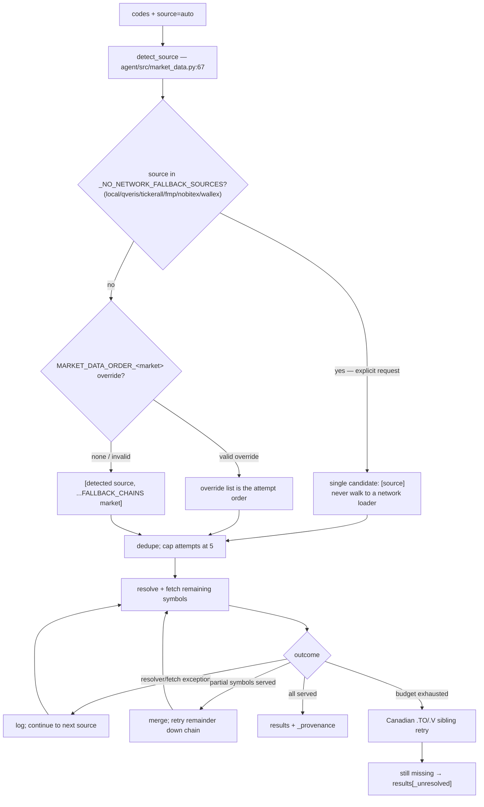

# Market-Data Pipeline Design

> How a requested symbol becomes an OHLCV frame in Vibe-Trading: code→source detection, per-market fallback chains, the loader registry, attempt budgeting, partial-success merging, env overrides, and the local DuckDB bridge.

## 1. Entry Points and Source Detection

The shared entry point is `fetch_market_data` (`agent/src/market_data.py:179-206`), used by MCP/agent tools such as `agent/src/tools/market_data_tool.py:12` and `agent/src/tools/technical_indicator_tool.py:18`.

`detect_source(code)` (`agent/src/market_data.py:67-72`) walks the ordered `_SOURCE_PATTERNS` table (`agent/src/market_data.py:21-64`) and returns the preferred source name; unmatched codes default to `tushare` (`:72`). Examples:

- `^local:` prefix → `local` (`:22`)
- six digits `.SZ/.SH/.BJ` → `tencent` (`:23`)
- 3–5 digits `.HK` → `tencent` (`:25`)
- `SYMBOL.US`, India `.NS/.BO`, Canada `.TO/.V`, UK `.L`, Argentina `.BA`, futures `=F`, FX `=X`, `^INDEX` → `yahoo` (`:24-45`)
- Korean six digits `.KS/.KQ` → `pykrx` (`:48`)
- `BTC-USDT` → `okx`; `BTC/USDT` → `ccxt`; Iranian IRT/TOMAN codes → `nobitex`/`wallex` (`:49-57`)
- `EUR/USD`, `EURUSD.FX` → `mt5` (`:62-63`)

The detected source is a member of its market's fallback chain, so a temporarily unavailable preferred source degrades gracefully.

## 2. Loader Registry and Protocol

- `DataLoaderProtocol` (`agent/backtest/loaders/base.py:795-814`) is a `@runtime_checkable` Protocol requiring `name: str`, `markets: set[str]`, `requires_auth: bool`, and `is_available()` / `fetch(...)`. An optional `volume_units` mapping declares board-lot vs share semantics per market.
- The global `LOADER_REGISTRY: dict[str, type]` lives at `agent/backtest/loaders/registry.py:25`; loaders self-register with the `@register` class decorator (`agent/backtest/loaders/registry.py:69-75`).
- `_ensure_registered()` (`agent/backtest/loaders/registry.py:78-100`) lazily imports all known loader modules so decorators fire regardless of import order; loaders missing optional dependencies are silently skipped.
- `get_loader_cls_with_fallback(source)` (`agent/backtest/loaders/registry.py:598-639`) returns an available loader class, instantiates defensively, and raises `NoAvailableSourceError` (`agent/backtest/loaders/base.py:107-108`) when nothing can serve. Sources in `_NO_NETWORK_FALLBACK_SOURCES` get actionable error hints instead of silent substitution (`:628-639`).

## 3. Fallback Chains

`FALLBACK_CHAINS` (`agent/backtest/loaders/registry.py:178-247`) defines the ordered source list per market (lighter, throttle-tolerant public endpoints first; key-gated vendors trail):

| Market | Chain (head → tail) |
| --- | --- |
| `a_share` | tencent, mootdx, eastmoney, baostock, akshare, tushare, gildata, local |
| `us_equity` | yahoo, stooq, sina, eastmoney, yfinance, tiingo, fmp, finnhub, alphavantage, longbridge, akshare, local |
| `hk_equity` | tencent, eastmoney, yahoo, futu, akshare, yfinance, tushare, longbridge, local |
| `india_equity` | yahoo, yfinance, india_broker, local |
| `kr_equity` | pykrx, yahoo, yfinance, local |
| `ca_equity` | yahoo, yfinance, local |
| `ar_equity` | yahoo, yfinance, local |
| `uk_equity` | yahoo, yfinance, local |
| `vietnam_equity` | yahoo, yfinance, local |
| `crypto` | okx, binance, ccxt, yfinance, local |
| `futures` | akshare, local |
| `fund` | tushare, akshare, local |
| `macro` | akshare, tushare, local |
| `forex` | mt5, akshare, yfinance, local |
| `index` | yahoo, yfinance, local |

The chain used for an auto-detected source is the **symbol's own market** chain when the source belongs to it (`agent/src/market_data.py:236-256`); name-only matching would be ambiguous because `yahoo` appears in several chains.

## 4. The Fetch Algorithm

Inside `fetch_market_data`, codes are grouped by `(source, market)` and each group walks its chain (`_fetch_via_chain`, `agent/src/market_data.py:258-345`):

1. Build the candidate list: `[detected, ...market_chain]`, de-duplicated and capped at `max_fallback_attempts = 5` (parameter at `agent/src/market_data.py:189`, cap applied at `:296-300`).
2. For each candidate source: resolve the loader class (`:310-317`). `NoAvailableSourceError` and any other resolver exception are caught and logged at debug, then the walk continues.
3. Instantiate and `fetch` the **remaining** symbols (`:318-327`); a fetch exception is logged at error and the walk continues (`:328-333`).
4. Partial success merges: symbols a source served are attributed to the actual serving loader (which may be a resolver-substituted alternative), removed from `remaining`, and symbols still missing are retried down the chain — one partial response no longer stops the walk (`:334-345`).
5. After the chain walk, Canadian `.TO`/`.V` unresolved codes get one venue-sibling retry (TSX ↔ TSX Venture), keyed under the originally requested symbol (`agent/src/market_data.py:429-483`).
6. Anything still unresolved is returned to the caller in `results["_unresolved"]` (`agent/src/market_data.py:485-486`) — never raised. With `include_provenance=True`, per-symbol metadata (`source`, `fallback_used`, `volume_unit`, price adjustment caliber, venue alias) is returned under `_provenance` (`:487-488`).



## 5. Environment Overrides

`MARKET_DATA_ORDER_<MARKET>` variables (A_SHARE, HK_EQUITY, US_EQUITY, INDIA_EQUITY, KR_EQUITY, CA_EQUITY, AR_EQUITY, UK_EQUITY, VIETNAM_EQUITY, CRYPTO, FUTURES, FUND, MACRO, FOREX, INDEX; schema at `agent/src/config/env_schema.py:232-246`) rewrite the attempt order.

- `refresh_source_order_overrides()` (`agent/backtest/loaders/registry.py:511-553`) is snapshot-gated and mutates `FALLBACK_CHAINS` **in place**, so both `from ... import FALLBACK_CHAINS` and attribute consumers see the new order. It runs at registry import time (`:556-558`) and again at the start of every `fetch_market_data` (`agent/src/market_data.py:220`) to pick up lazily loaded `.env` values.
- The value must be a permutation of the market's default chain; an invalid value logs a warning and keeps the default (`agent/backtest/loaders/registry.py:544-552`).
- Overrides apply only to `source="auto"` calls. An explicit source argument always stays first, and explicit pinned sources never walk.

## 6. Hard Constraints (No Silent Substitution)

The frozenset `_NO_NETWORK_FALLBACK_SOURCES = {"local", "qveris", "tickerall", "fmp", "nobitex", "wallex"}` (`agent/backtest/loaders/registry.py:155-157`) pins two guarantees:

- An **explicit** `local`, `fmp`, or `tickerall` request never triggers fallback. In particular an explicit `fmp` request that gets a stable HTTP 403 must not silently return Yahoo data (issue #1270, noted at `agent/src/market_data.py:277-279`), and a missing Data Bridge config must surface as a local-loader error instead of network data the user never asked for (`agent/backtest/loaders/registry.py:623-639`).
- `nobitex`/`wallex` quote Iranian Toman markets with no substitute; degrading to a USDT chain would be a caliber error of orders of magnitude (`agent/backtest/loaders/registry.py:150-157`).

## 7. The `local:` DuckDB Bridge

1. Populate the embedded warehouse (network required, free sources, no key):

   ```bash
   cd agent
   python scripts/local_db/init_local_db.py [--symbols 01810.HK,...] \
       [--start YYYY-MM-DD] [--end YYYY-MM-DD] [--db PATH] \
       [--skip-fx] [--skip-shares]
   ```

   Default DB: `~/.vibe-trading/data/market.duckdb` (`agent/scripts/local_db/init_local_db.py:48`); DDL: `agent/scripts/local_db/schema.sql`; all writes are idempotent `INSERT OR REPLACE`.

2. Map a symbol in `~/.vibe-trading/data-bridge/config.yaml` to a CSV, Parquet, or DuckDB query. The loader reads this config (`agent/backtest/loaders/local_loader.py:46-47`, docstring example at `:1-30`); it registers with `requires_auth=False` and applies its own start/end truncation.
3. Request the symbol with the prefix, e.g. `local:01810.HK`; results are aliased back to the unprefixed code (`agent/src/market_data.py:224-229`).

## 8. Operational Notes

- **Mainland-China networks:** `yfinance` and the Yahoo endpoints (`yahoo` loader, head of the US/India/UK/Korea chains) are generally unreachable from mainland-China IPs. For A-shares and HK equities the chains intentionally lead with Tencent/Eastmoney; for US symbols, configure an alternative (e.g. a reachable vendor key such as FMP/Tiingo via `MARKET_DATA_ORDER_US_EQUITY`, or a populated `local:` warehouse).
- Per-source politeness intervals exist (`VIBE_TRADING_{EASTMONEY,SINA,STOOQ,YAHOO,...}_MIN_INTERVAL`, documented in `agent/.env.example:226`) and are consumed by loader rate limiters.
- Price caliber differs by source (raw vs split/dividend-adjusted); consumers must read the serving loader's caliber / `_provenance` rather than assume one — see `PRICE_CALIBER_BY_SOURCE` at `agent/backtest/loaders/registry.py:260-283`.
