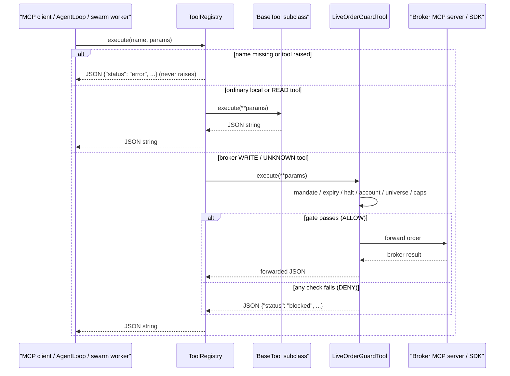

# Tool Subsystem Design

> How tools are defined, discovered, registered, executed, and safety-wrapped in Vibe-Trading: the BaseTool contract, the auto-discovery registry, remote MCP wrapping, the live broker order gate, and the swarm registry.

## 1. The BaseTool Contract

Every capability the model can call is a subclass of `BaseTool` (`agent/src/agent/tools.py:13-65`), an ABC with:

- Class attributes: `name` (unique id), `description` (shown to the LLM), `parameters` (JSON Schema), `repeatable`, `is_readonly = True` by default, `deterministic = False`, `replay_after_compaction = False`.
- `check_available()` (`agent/src/agent/tools.py:43-50`) — classmethod returning `False` when optional dependencies/credentials are missing; such a tool is silently excluded from the registry.
- `execute(**kwargs) -> str` (`agent/src/agent/tools.py:52-54`) — abstract; implementations **must return a JSON string**.
- `to_openai_schema()` (`agent/src/agent/tools.py:56-65`) — OpenAI function-calling schema used by both the agent loop and the MCP surface.

Attribute semantics:

- `is_readonly` — no state-changing side effects. Read-only tools run in a worker thread with a bounded timeout (`agent/src/agent/loop.py:2898-2914`); non-readonly tools run on the watchdog path.
- `deterministic` — pure computation: identical args yield identical results, so the loop may serve repeated identical calls from cache (`agent/src/agent/tools.py:33-36`).
- `repeatable` / `replay_after_compaction` — whether the tool may be called multiple times and whether an exact successful read-only result may be restored after context compaction.

## 2. ToolRegistry: Errors Are Data

`ToolRegistry` (`agent/src/agent/tools.py:68-169`) maps names to instances and offers `register@76`, `get@80`, `get_definitions@84`, and `execute@107`.

The core guarantee is in `execute` (`agent/src/agent/tools.py:107-149`): it **never raises** and always returns a JSON string.

- Tool missing because a discovery/registration failure was recorded → an error payload carrying `registry_incomplete: true` and the failed source (`:111-125`).
- Tool genuinely unknown → `{"status": "error", "error": "Tool '<name>' not found"}`, augmented with the failure count when the registry is incomplete (`:127-141`).
- Tool raised during execution → the exception is logged and returned as `{"status": "error", "tool": name, "error": str(exc)}` (`:142-149`).

Import/registration failures are captured in `_import_failures` / `_registration_failures` and exposed read-only (`:151-163`). This is what lets the ReAct loop treat tool output uniformly as model-visible text.

## 3. Auto-Discovery

`build_registry` (`agent/src/tools/__init__.py:76-125`) assembles the production registry in two phases:

1. **Module import sweep** (`_discover_subclasses`, `agent/src/tools/__init__.py:34-73`): `pkgutil.iter_modules` walks the package directory and `importlib.import_module` imports every non-underscore module (`:48-52`). A module that raises is caught, logged at WARNING with its name, and recorded in the module-level `_DISCOVERY_FAILURES` dict (`:53-61`) — one broken optional dependency never shrinks the rest of the registry.
2. **Subclass BFS**: starting from `BaseTool.__subclasses__()`, a deque walk collects every concrete subclass with a non-empty `name`, transitively covering intermediate base classes (`:63-69`). Results are cached in `_SUBCLASSES_CACHE`.

`build_registry` then instantiates the discovered classes (respecting `check_available()`), injects shared collaborators (`PersistentMemory`, session id, event/warn callbacks), optionally includes the shell tools (`bash`, `background_run`, `cancel_background` — `_SHELL_TOOL_NAMES` at `agent/src/tools/__init__.py:31`), and finally appends remote MCP tools when `agent_config` defines MCP servers. Each MCP server is isolated: one server failing to connect only skips that server.

A separate `build_swarm_registry` (`agent/src/tools/__init__.py:310`) assembles the narrower tool set given to swarm workers (`agent/src/swarm/worker.py:36`).

## 4. Remote MCP Tools

- `MCPRemoteToolSpec` (`agent/src/tools/mcp.py:292-309`) is the resolved metadata for one remote tool, including the server-advertised MCP annotations. Those annotations are **advisory input from a potentially untrusted server** and never the sole basis for relaxing safety.
- `build_mcp_tool_wrappers` (`agent/src/tools/mcp.py:312`) connects to a configured MCP server and wraps each discovered tool.
- `MCPRemoteTool(BaseTool)` (`agent/src/tools/mcp.py:836`) executes calls through an `MCPServerAdapter`.
- The MCP server obtains the registry lazily as a singleton (`agent/mcp_server.py:327-334`) and each `@mcp.tool` function is a thin adapter into `registry.execute(...)`; e.g. `load_skill` at `agent/mcp_server.py:522-542`. Shell tools are off by default for every transport.

## 5. Live Broker Tools: the Second Wrapping

Broker MCP tools get wrapped **twice**. `wrap_live_broker_tools` (`agent/src/live/registry.py:184-238`) re-classifies each discovered tool:

- **READ** → the plain wrapper passes through, forced to `is_readonly = True` (`agent/src/live/registry.py:225-227`).
- **WRITE / UNKNOWN** → replaced by `LiveOrderGuardTool` over the same adapter/spec (`:235-237`). Classification is three-tier: MCP annotations → broker curated map → default-deny; UNKNOWN is treated as WRITE (fail-closed).
- **Halt tripped** → WRITE/UNKNOWN tools are omitted from the assembled list entirely, so a halted session's tool list does not even contain them (`:228-234`). This registration-time half is defense-in-depth against the race where the flag flips mid-turn; the call-time gate is the un-bypassable half.

`LiveOrderGuardTool.execute` (`agent/src/live/order_guard.py:134-173`) runs the pre-trade gate and returns ALLOW (forwarded broker result) or a structured `status: "blocked"` refusal. In order it checks:

1. mandate exists and `schema_version == MANDATE_SCHEMA_VERSION` (`:145-151`);
2. mandate not expired (`:153-159`);
3. halt flag not tripped (`:161-166`);
4. account binding matches the mandate (`:168-179`);
5. order intent extraction plus instrument-universe / hard-cap / counter checks (`:181` onward).

The mandate domain model lives in `agent/src/live/mandate/model.py:123` (HardCaps, UniverseConstraint); `agent/src/live/halt.py` owns the kill-switch flag.

## 6. Call Sequence

## 7. Adding a New Tool

1. Create a file under `agent/src/tools/` with a class extending `BaseTool` (the module docstring at `agent/src/tools/__init__.py:1-9` states the contract: create the file, done).
2. Set unique `name`, LLM-facing `description`, and JSON-Schema `parameters`; implement `execute(**kwargs) -> str` returning JSON.
3. Declare behavior honestly: `is_readonly=False` for anything that writes, `deterministic=True` only for pure calculations, `repeatable=False` for one-shot actions.
4. Override `check_available()` if the tool needs an optional package or key — return `False` instead of raising at import time.
5. Need shared state (memory, session id, event bus)? Accept it the way other tools do via `build_registry` injection; do not instantiate new global singletons.
6. Never raise across the tool boundary: catch internally and return `{"status": "error", ...}` — the registry also enforces this as a backstop.
7. A tool that reaches a live broker write path must not call the connector directly; it goes through the mandate/halt/classification machinery in `agent/src/live/`.
